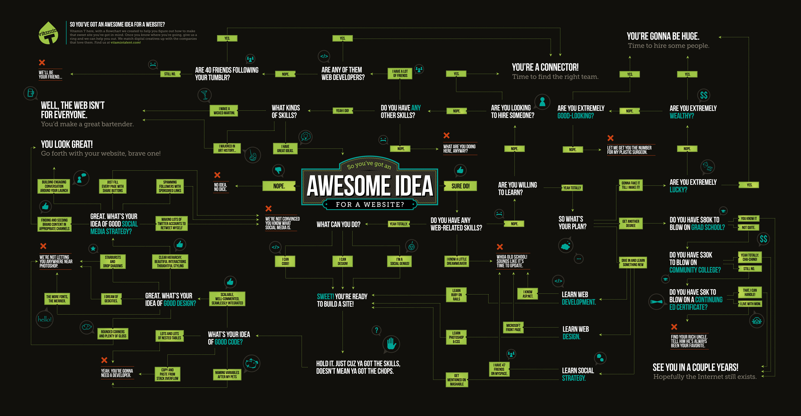

# 🌐 Awesome website idea

<a id="flowchart"></a>

<p align="center"></p>

## ℹ️ O projekcie

#### [🇬🇧 English version](#ℹ️-about-the-project)

Program powstał na przedmiocie `Sztuczna inteligencja`, na V semestrze studiów pierwszego stopnia na kierunku Informatyka na Politechnice Poznańskiej.

### ❔ Co robi aplikacja?

Jest to desktopowa aplikacja napisana w Pythonie, która prowadzi użytkownika przez [serię pytań](#flowchart), weryfikujących jego pomysł na stronę internetową. Python obsługuje interfejs graficzny, a mózgiem odpowiadającym za generowanie kolejnych pyta jest system ekspercki zaimplementowany w języku CLIPS.

### 🛠️ Technologie

* Python
* PySide6 - GUI
* CLIPS - system ekspercki
* clipsy - łącznik między CLIPS a Pythonem

### 📁 Struktura projektu

```
.
├── main.py       # obsługa GUI oraz interakcji z CLIPS
├── website.clp   # reguły systemu (deftemplate qview oraz lista reguł)
└── flowchart.jpg # wizualna reprezentacja przebiegu decyzji
```

### 🚀 Uruchomienie aplikacji

1. Upewnij się, że masz zainstalowane potrzebne zależności (`PySide6`, `clipspy`).
2. Uruchom poleceniem `> python main.py` (lub `> python3 main.py` na Linuxie).
3. Wybieraj odpowiedzi na kolejne pytania.

### 👥 Autorzy

* [Jakub Pilarski](https://github.com/jpilarski)
* [Jakub Kolasiński](https://github.com/KubotKolas)

## ℹ️ About the project

#### [🇵🇱 Wersja polska](#ℹ️-o-projekcie)

The program was created for the `Artificial Intelligence` course during the 5th semester of the Bachelor's degree in Computer Science at Poznan University of Technology.

### ❔ What does the application do?

This is a desktop application written in Python that guides the user through a [series of questions](#flowchart) to evaluate their website idea. Python handles the graphical user interface, while the expert system implemented in CLIPS generates the next questions.

### 🛠️ Technologies

* Python
* PySide6 - GUI
* CLIPS - expert system
* clipsy - bridge between CLIPS and Python

### 📁 Project structure

```
.
├── main.py       # GUI and CLIPS interaction handling
├── website.clp   # expert system rules (deftemplate qview and rule list)
└── flowchart.jpg # visual representation of decision flow
```

### 🚀 Running the application

1. Make sure you have the required dependencies installed (`PySide6`, `clipspy`).
2. Run with `> python main.py` (or `> python3 main.py` on Linux).
3. Choose answers to the questions as they appear.

### 👥 Authors

* [Jakub Pilarski](https://github.com/jpilarski)
* [Jakub Kolasiński](https://github.com/KubotKolas)
